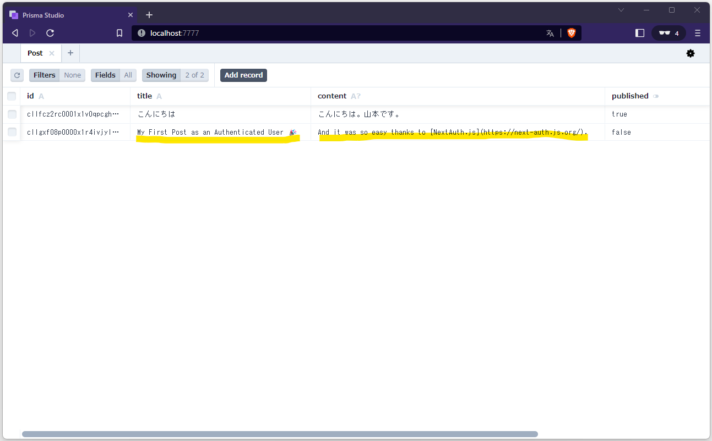

## Next.js + Prisma + Vercel Postgres を使ったアプリの作成手順（デプロイまで）

Prisma は、Node.js および TypeScript アプリケーションでデータベースにアクセスするために使用できる
次世代 ORM である。
この手順では、以下のツールを使ってサンプルアプリを作成していく。

|ツール |役割 |
|:-- |:-- |
|Next.js |React フレームワーク |
|Next.js API Routes |バックエンドとしてのサーバ側 API ルート |
|Prisma |マイグレーションを含む DB アクセスのための ORM フレームワーク |
|Vercel Postgres |PostgreSQL データベース |
|NextAuth.js |Google（OAuth）経由の認証用 |
|TypeScript |プログラミング言語 |
|Vercel |デプロイ先サーバ |

### もくじ

- Step.01: Next.js スターター プロジェクトをセットアップする
- Step.02: Prismaをセットアップし､PostgreSQLデータベースにアクセスする
- Step.03: Prisma をセットアップし、データベース スキーマを作成する
- Step.04: Prisma クライアントをインストールして生成する
- Step.05: データベースからデータを読み込むために、既存のビューを更新する
- Step.06: NextAuth で GitHub 認証を設定する
- Step.07: ログイン機能を追加する
- Error Recovery: サインイン時のエラー
- Step.07-01: Google 認証を追加する
- Step.07-02: カスタムログインページを作成する
- Step.08: 投稿機能を追加する
- Error Recovery: Prisma Client のエラー
- Step.09: 下書き機能を追加する
- Step.10: 公開機能を追加する
- Step.11: 削除機能の追加


### 前提条件

この手順を行うには、以下のものが必要になる。

- Node.js
- Vercel アカウント（PostgreSQL のセットアップ、アプリデプロイのため）
- Google アカウント（OAuth アプリを作成するため）

### Step.01: Next.js スターター プロジェクトをセットアップする

任意のディレクトリに移動して、ターミナルで次のコマンドを実行し、新しい Next.js プロジェクトをセットアップする。

Next.js + Prisma のスタータープロジェクトを作成:  
``` console
npx create-next-app --example https://github.com/prisma/blogr-nextjs-prisma/tree/main blogr-nextjs-prisma
```

ディレクトリに移動してアプリを起動する。

プロジェクトのディレクトリに移動してアプリを起動:  
``` console
cd blogr-nextjs-prisma && npm run dev
```

ブラウザで http://localhost:3000 にアクセスして、Next.js アプリを確認する。


このアプリには現在、'index.ts' ファイルの 'getStaticProps' から返されるハードコードされたデータが表示されている。
この後のセクションでは、実際のデータベースからデータが返されるように、これを変更する。

### Step.02: Prismaをセットアップし､PostgreSQLデータベースにアクセスする

この手順では、Vercel でホストされている無料の Postgres データベースを使用する。
まず、Step.01 でクローンしたソースコードを新規作成した GitHub リポジトリにプッシュし、
Vercel にデプロイして Vercel プロジェクトを作成する。


Vercel プロジェクトを作成したら、[Storage] タブをクリックする。データベースの中から、
Postgresの [Create]ボタンをクリックする。
Connect a Database モーダルが開いたら、「Postgres」のラジオボタンを選択し 、
「Continue」ボタンをクリックする。

[ストレージ] タブを選択:  
![[ストレージ] タブを選択](./captures/03_select_storage_tab.png)

Postgresの [Create]ボタンをクリック:  
![Postgresの [Create]ボタンをクリック](./captures/04_click_create_button_of_postgres.png)

「Postgres」のラジオボタンを選択し 、「Continue」ボタンをクリック:  


Vercel Postgers がベータ版でリスクがあることを理解して、「Accept」ボタンをクリックする。

「Accept」ボタンをクリック:  


新しいデータベースを作成するには、開いたダイアログで次の手順を実行する。

1. [Database Name] に「sample_postgres_db」(またはその他の任意の名前)を入力する。
名前には英数字、「_」、「-」のみを含めることができ、32 文字を超えることはできない。

2. [Region] で地域を選択する。現時点（2023/08/12）では、「Washington, D.C., USA - (iad1)」を選択する。
これ以外の地域を選択すると、「Serverless Functionsとデータ間のレイテンシが増加します」との警告が表示されるためだ。

データベース名と地域を入力して「Create & Continue」ボタンをクリック:  


どこの環境で利用できるようにしたいか問われるので、特に支障がなければ、

環境を選択して「Connect」ボタンをクリック:


ローカルに Vercel CLI を導入していない場合は、以下のコマンドで Vercel CLI をインストールする。

Vercel CLI をインストール:  
``` console
npm i -g vercel@latest
```

Vercel CLI がインストールされたことの確認:  
``` console
vercel --version
```

確認結果:  
```
Vercel CLI 31.2.3
```

最新の環境変数をプルダウンして、ローカル プロジェクトが Postgres データベースで動作するようにする。

必要なすべての環境変数を Vercel プロジェクトからローカルにプルダウン:  
``` console
vercel env pull .env.local
```

実行結果:  
```
Vercel CLI 31.2.3
> > No existing credentials found. Please log in:
? Log in to Vercel github
> Success! GitHub authentication complete for hsmt72k@gmail.com
Error: Your codebase isn’t linked to a project on Vercel. Run `vercel link` to begin.
```

「Error: Your codebase isn’t linked to a project on Vercel. Run `vercel link` to begin.」の
エラーが発生した場合は、ローカル環境と Vercel プロジェクトの紐付けが済んでいないので、
先に以下のコマンドを実行する。

ローカル環境と Vercel プロジェクトの紐付け:  
``` console
vercel link
```

実行結果:  
```
Vercel CLI 31.2.3
? Set up “~\Desktop\github.hsmt72k\how_to_deploy_with_nextjs_prisma_vercelpostgres”? [Y/n] y
? Which scope should contain your project? hsmt72k
? Found project “hsmt72k/how-to-deploy-with-nextjs-prisma-vercelpostgres”. Link to it? [Y/n] y
✅  Linked to hsmt72k/how-to-deploy-with-nextjs-prisma-vercelpostgres (created .vercel and added it to .gitignore)
```

再度 `vercel env pull .env.local` を実行した結果: 
```
Vercel CLI 31.2.3
> Downloading `development` Environment Variables for Project how-to-deploy-with-nextjs-prisma-vercelpostgres
✅  Created .env.local file and added it to .gitignore 
```

ローカルのプロジェクト内に作成された `.env.local` ファイルを開いて、環境変数の内容を確認する。

これで Vercel Postgres データベースの準備が完了し、
それをローカルおよび Vercel 上で実行するための環境変数がすべて揃った。

### Step.03: Prisma をセットアップし、データベース スキーマを作成する

次に、Prisma をセットアップし、PostgreSQL データベースに接続する。
まず、npm 経由で Prisma CLI をインストールする。

Prisma CLI をインストール:  
``` console
npm install prisma --save-dev
```

次に、Prisma CLIを使用してデータベースにテーブルを作成する。

これを行うには、prisma フォルダを作成し、schema.prisma というファイルを追加して、
データベース・スキーマを含むメインの Prisma 構成ファイルにする。

schema.prisma に以下のモデル定義をコーディングする。

prisma/schema.prisma:  
``` prisma
generator client {
  provider = "prisma-client-js"
  previewFeatures = ["jsonProtocol"]
}

datasource db {
  provider = "postgresql"
  url = env("POSTGRES_PRISMA_URL") // uses connection pooling
  directUrl = env("POSTGRES_URL_NON_POOLING") // uses a direct connection
}

model Post {
  id        String     @default(cuid()) @id
  title     String
  content   String?
  published Boolean @default(false)
  author    User?   @relation(fields: [authorId], references: [id])
  authorId  String?
}

model User {
  id            String       @default(cuid()) @id
  name          String?
  email         String?   @unique
  createdAt     DateTime  @default(now()) @map(name: "created_at")
  updatedAt     DateTime  @updatedAt @map(name: "updated_at")
  posts         Post[]
  @@map(name: "users")
}
```

> 注意: ときどき `@map` や `@@map` を使って、フィールド名やモデル名をデータベースの
異なるカラム名やテーブル名にマップすることがある。
これは、NextAuth.js が、データベース内の特定のものを特定の方法で呼び出すために、
特別な要求をしているからである。

この Prisma スキーマは2つのモデルを定義し、
それぞれが基礎となるデータベースのテーブルにマッピングされる（User と Post）。
2つのモデルの間には、Post の author フィールドと User の posts フィールドを介した関係（一対多）
もあることに注意する。

実際にデータベースにテーブルを作成するには、環境変数が読み込めるように `.env.local` を `.env` に
リネームした上で、Prisma CLI の以下のコマンドを実行する。

Prisma スキーマに基づいてデータベースにテーブルを作成:  
``` console
npx prisma db push
```

実行結果:  
```
Environment variables loaded from .env
Prisma schema loaded from prisma\schema.prisma
Datasource "db": PostgreSQL database "verceldb", schema "public" at "ep-fancy-truth-23617763.us-east-1.postgres.vercel-storage.com"

Your database is now in sync with your Prisma schema. Done in 6.66s

Running generate... (Use --skip-generate to skip the generators)
warn Preview feature "jsonProtocol" is deprecated. The functionality can be used without specifying it as a preview feature.

added 2 packages, and audited 98 packages in 3s

52 packages are looking for funding
  run `npm fund` for details

1 moderate severity vulnerability

To address all issues, run:
  npm audit fix --force

Run `npm audit` for details.

✔ Generated Prisma Client (5.1.1 | library) to .\node_modules\@prisma\client in 48ms
```

Vercel の Storage で、以下の Query を実行してみると、users と Post テーブルができていることが分かる。

Vercel で Query を実行:  


テーブルが作成されていることが確認できたら、Prisma Studio を使用して、初期ダミーデータを追加していく。

Prisma Studio をポート番号 7777 で起動:  
``` console
npx prisma studio --port 7777
```

Prisma Studio のインターフェイスを使用して、新しいユーザーレコードとポストレコードを作成し、
それらの関係フィールドを介して接続する。

新規 User レコードを作成:  


User に紐づけて新規 Post レコードを作成:  


### Step.04: Prisma クライアントをインストールして生成する

Prisma を使用して Next.js からデータベースにアクセスするには、
まずアプリに Prisma クライアントをインストールする必要がある。

Prisma クライアント パッケージをインストール:  
``` console
npm install @prisma/client
```

Prisma Client はスキーマに合わせて調整されるため 、Prisma スキーマファイル（schema.prisma）が変更されるたびに、
次のコマンドを実行して更新する必要がある。

Prismaスキーマを再生成:  
``` console
npx prisma generate
```

1つの PrismaClient インスタンスを使用し、必要なファイルにインポートできる。
インスタンスは、lib/ディレクトリ内の prisma.ts ファイルに作成される。
そのためにまずは、ディレクトリとファイルを作成する必要がある。

Prisma ライブラリ用の新しいフォルダとファイルを作成:  
``` console
mkdir lib && touch lib/prisma.ts
```

Prisma Client に接続するために、prisma.ts ファイルに以下のコードを記述する。

lib/prisma.ts:
``` ts
import { PrismaClient } from '@prisma/client';

let prisma: PrismaClient;

if (process.env.NODE_ENV === 'production') {
  prisma = new PrismaClient();
} else {
  if (!global.prisma) {
    global.prisma = new PrismaClient();
  }
  prisma = global.prisma;
}

export default prisma;
```

これで、データベースへのアクセスが必要なときはいつでも、
必要なファイルに Prisma インスタンスをインポートできる。

### Step.05: データベースからデータを読み込むために、既存のビューを更新する

現状、pages/index.tsx に実装されているブログ記事フィードと pages/p/[id].tsx の記事詳細ビューは、
ハードコードされたデータを返している。
このステップでは、Prisma Client を使用してデータベースからデータを返すように実装を変更する。

pages/index.tsx を開き、まずは既存の import 宣言のすぐ下に以下のコードを追加する。

pages/index.tsx:  
``` tsx
import prisma from '../lib/prisma';
```

Prisma インスタンスは、データベースにデータを読み書きする際のインターフェイスとなりる。
たとえば、`prisma.user.create()` を呼び出して新しい User レコードを作成したり、
`prisma.post.findMany()` を呼び出してデータベースからすべての Post レコードを取得したりすることができる。
Prisma Client API の概要は、Prisma ドキュメントを参照する。

CRUD - Prisma Client | Prisma Documentation  
https://www.prisma.io/docs/concepts/components/prisma-client/crud

これで、index.tsx 内の `getStaticProps` にハードコードされた feed オブジェクトを、
データベースへの適切な呼び出しに置き換えることができる。

pages/index.tsx:  
``` tsx
export const getStaticProps: GetStaticProps = async () => {
  const feed = await prisma.post.findMany({
    where: { published: true },
    include: {
      author: {
        select: { name: true },
      },
    },
  });
  return {
    props: { feed },
    revalidate: 10,
  };
};
```

Prisma Client クエリのポイントは、以下の2点である。

- where フィルターは、published が true の Post レコードのみを含むように指定している
- Post レコードの作者名も照会され、返されるオブジェクトに含まれる

アプリを実行する前に、`/pages/p/[id].tsx` に移動し、
データベースから正しい Post レコードを読み込むように実装を修正する。

このページでは、`getStaticProps（SSG）` の代わりに `getServerSideProps（SSR）` を使用している。
これはデータが動的で、URL でリクエストされた Post の id に依存するからである。
例えば、`/p/42` のビューは、id が 42 の Post を表示することになる。

前と同じように、まず Prisma Client をページにインポートする必要がある。

pages/p/[id].tsx:  
``` tsx
import prisma from '../../lib/prisma';
```

これで `getServerSideProps` の実装を変更して、データベースから適切な post を取得し、
コンポーネントの props を通してフロントエンドで利用できる。

pages/p/[id].tsx:  
``` tsx
export const getServerSideProps: GetServerSideProps = async ({ params }) => {
  // ID にひもづく投稿を取得
  const post = await prisma.post.findUnique({
    where: {
      id: String(params?.id),
    },
    include: {
      author: {
        select: { name: true },
      },
    },
  });
  return {
    props: post,
  };
};
```

これで完了。アプリが起動しなくなった場合は、以下のコマンドで再起動できる。

アプリを起動:  
``` console
npm run dev
```

起動していれば、ファイルを保存し、ブラウザから http://localhost:3000 にアクセスしてアプリを開く。
Post のレコードが以下のように表示される。

データベースに登録されている Post が表示される:  


`pages/p/[id].tsx` も修正したので、post をクリックして詳細表示に移動することもできる。

詳細表示に移動:  


### Step.06: NextAuth で GitHub 認証を設定する

このステップでは、アプリに GitHub 認証機能を追加する。
この機能が使えるようになったら、認証されたユーザーが UI から投稿を作成・公開・削除できるようにする。

最初のステップとして、NextAuth.js ライブラリをアプリにインストールする。

NextAuth ライブラリと NextAuth Prisma アダプタをインストール:  
``` console
npm install next-auth@4 @next-auth/prisma-adapter
```

次に、データベースのスキーマを変更して、NextAuth が必要とするテーブルを追加する。

データベースのスキーマを変更するには、手動で Prisma スキーマに変更を加え、
`prisma db push` コマンドを再度実行する必要がある。

まずは、`prisma/schema.prisma` を開き、その中のモデルを次のように変更する。

prisma/schema.prisma:  
``` prisma
model Post {
  id        String  @id @default(cuid())
  title     String
  content   String?
  published Boolean @default(false)
  author    User?   @relation(fields:[authorId], references:[id])
  authorId  String?
}

model Account {
  id                 String  @id @default(cuid())
  userId             String  @map("user_id")
  type               String
  provider           String
  providerAccountId  String  @map("provider_account_id")
  refresh_token      String?
  access_token       String?
  expires_at         Int?
  token_type         String?
  scope              String?
  id_token           String?
  session_state      String?
  oauth_token_secret String?
  oauth_token        String?

  user User @relation(fields:[userId], references:[id], onDelete: Cascade)

  @@unique([provider, providerAccountId])
}

model Session {
  id           String   @id @default(cuid())
  sessionToken String   @unique@map("session_token")
  userId       String   @map("user_id")
  expires      DateTime
  user         User     @relation(fields:[userId], references:[id], onDelete: Cascade)
}

model User {
  id            String    @id @default(cuid())
  name          String?
  email         String?   @unique
  emailVerified DateTime?
  image         String?
  posts         Post[]
  accounts      Account[]
  sessions      Session[]
}

model VerificationToken {
  id         Int      @id @default(autoincrement())
  identifier String
  token      String   @unique
  expires    DateTime

  @@unique([identifier, token])
}
```

これらのモデルの詳細については、NextAuth.js のドキュメントを確認する。

Models | Auth.js API Reference  
https://authjs.dev/reference/adapters#models

データベースに実際のテーブルを作成することで、データベーススキーマを変更することができる。
それには次のコマンドを実行する。

Prisma スキーマに基づいてデータベースにテーブルを作成:  
``` console
npx prisma db push
```

GitHub 認証を使うので、GitHub 上で OAuth アプリを新規作成する必要がある。

Building OAuth apps | GitHub Docs  
https://docs.github.com/en/apps/oauth-apps/building-oauth-apps

それにはまず、GitHub アカウントにログインする。
そして、[[Settings](https://github.com/settings/profile)] > 
[[Developer Settings](https://github.com/settings/apps)] > 
[[OAuth Apps](https://github.com/settings/developers)] と順番にページを開いていく。

GitHub で新しい OAuth アプリケーションを作成:  


Register a new application（またはNew OAuth App）ボタンをクリックすると、アプリの情報を入力するための登録フォームにリダイレクトされる。
認証コールバック URL は、Next.js の `/api/auth` Routeとなる  `http://localhost:3000/api/auth` である。

ここで注意すべき重要な点は、Auth0 などとは異なり、Authorization コールバックURLフィールドは単一のURLしかサポートしていないということ。
つまり、後で本番用の URL を指定してアプリをデプロイしたい場合は、新たに GitHub OAuth アプリを立ち上げる必要があるということである。

Authorization コールバック URL が正しいことを確認して登録:


アプリケーションの登録ボタンをクリックすると、新しく生成されたクライアントIDとクライアントシークレットが表示される。
この情報をコピーし、`GITHUB_ID` および `GITHUB_SECRET` 環境変数としてルートディレクトリの .env ファイルに貼り付ける。
また、GitHub で設定した認証コールバックと同じ値 http://localhost:3000/api/auth を `URLNEXTAUTH_URL` に設定する。

.env:  
``` .env
# GitHub OAuth
GITHUB_ID=6bafeb321963449bdf51
GITHUB_SECRET=509298c32faa283f28679ad6de6f86b2472e1bff
NEXTAUTH_URL=http://localhost:3000/api/auth
```

クライアントIDとクライアントシークレット:  


開発環境では設定しないくても、ワーニングのみでエラーが出ないが、
トークンのハッシュ、Cookie の署名/暗号化、および暗号化キーの生成に使用するランダムな文字列も .env に設定しておく。

.env:  
``` .env
NEXTAUTH_SECRET=ランダムな文字列
```

ランダムな文字列は以下のコマンドで作成することができる。

ランダム文字列生成:  
``` console
openssl rand -base64 32
```

また、アプリケーション全体でユーザーの認証状態を永続化する必要がある。
アプリケーションのルートファイル `_app.tsx` を変更して、
現在のルートコンポーネントを next-auth/react パッケージの `SessionProvider` で囲む。

pages/_app.tsx:  
``` tsx
import { SessionProvider } from 'next-auth/react';
import { AppProps } from 'next/app';

const App = ({ Component, pageProps }: AppProps) => {
  return (
    <SessionProvider session={pageProps.session}>
      <Component {...pageProps} />
    </SessionProvider>
  );
};

export default App;
```

### Step.07: ログイン機能を追加する

ログインボタンとその他の UI コンポーネントを Header.tsx ファイルに追加する。

components/Header.tsx
``` tsx
import React from 'react';
import Link from 'next/link';
import { useRouter } from 'next/router';
import { signOut, useSession } from 'next-auth/react';

const Header: React.FC = () => {
  const router = useRouter();
  const isActive: (pathname: string) => boolean = (pathname) =>
    router.pathname === pathname;

  const { data: session, status } = useSession();

  let left = (
    <div className="left">
      <Link legacyBehavior href="/">
        <a className="bold" data-active={isActive('/')}>
          Next.js + Prisma + PostgreSQL BLOGGIN
        </a>
      </Link>
      <style jsx>{`
        .bold {
          font-weight: bold;
        }

        a {
          text-decoration: none;
          color: var(--geist-foreground);
          display: inline-block;
        }

        .left a[data-active='true'] {
          color: gray;
        }

        a + a {
          margin-left: 1rem;
        }
      `}</style>
    </div>
  );

  let right = null;

  if (status === 'loading') {
    left = (
      <div className="left">
        <Link legacyBehavior href="/">
          <a className="bold" data-active={isActive('/')}>
            Feed
          </a>
        </Link>
        <style jsx>{`
          .bold {
            font-weight: bold;
          }

          a {
            text-decoration: none;
            color: var(--geist-foreground);
            display: inline-block;
          }

          .left a[data-active='true'] {
            color: gray;
          }

          a + a {
            margin-left: 1rem;
          }
        `}</style>
      </div>
    );
    right = (
      <div className="right">
        <p>Validating session ...</p>
        <style jsx>{`
          .right {
            margin-left: auto;
          }
        `}</style>
      </div>
    );
  }

  if (!session) {
    right = (
      <div className="right">
        <Link legacyBehavior href="/api/auth/signin">
          <a data-active={isActive('/signup')}>Log in</a>
        </Link>
        <style jsx>{`
          a {
            text-decoration: none;
            color: var(--geist-foreground);
            display: inline-block;
          }

          a + a {
            margin-left: 1rem;
          }

          .right {
            margin-left: auto;
          }

          .right a {
            border: 1px solid var(--geist-foreground);
            padding: 0.5rem 1rem;
            border-radius: 3px;
          }
        `}</style>
      </div>
    );
  }

  if (session) {
    left = (
      <div className="left">
        <Link legacyBehavior href="/">
          <a className="bold" data-active={isActive('/')}>
            Feed
          </a>
        </Link>
        <Link legacyBehavior href="/drafts">
          <a data-active={isActive('/drafts')}>My drafts</a>
        </Link>
        <style jsx>{`
          .bold {
            font-weight: bold;
          }

          a {
            text-decoration: none;
            color: var(--geist-foreground);
            display: inline-block;
          }

          .left a[data-active='true'] {
            color: gray;
          }

          a + a {
            margin-left: 1rem;
          }
        `}</style>
      </div>
    );
    right = (
      <div className="right">
        <p>
          {session.user.name} ({session.user.email})
        </p>
        <Link legacyBehavior href="/create">
          <button>
            <a>New post</a>
          </button>
        </Link>
        <button onClick={() => signOut()}>
          <a>Log out</a>
        </button>
        <style jsx>{`
          a {
            text-decoration: none;
            color: var(--geist-foreground);
            display: inline-block;
          }

          p {
            display: inline-block;
            font-size: 13px;
            padding-right: 1rem;
          }

          a + a {
            margin-left: 1rem;
          }

          .right {
            margin-left: auto;
          }

          .right a {
            border: 1px solid var(--geist-foreground);
            padding: 0.5rem 1rem;
            border-radius: 3px;
          }

          button {
            margin: 0.4em;
            background: #ececec;
            border: 1px solid #aaa;
            border-radius: 0.4em;
          }

          button:hover {
            background: #eee;
            box-shadow: 0px 0px 2px #ccc;
          }
        `}</style>
      </div>
    );
  }

  return (
    <nav>
      {left}
      {right}
      <style jsx>{`
        nav {
          display: flex;
          padding: 2rem;
          align-items: center;
        }
      `}</style>
    </nav>
  );
};

export default Header;
```

以下は、ヘッダーがどのようにレンダリングされるかの概要である。

- ユーザーが認証されていない場合、ログインボタンを表示する
- ユーザーが認証されている場合は、My drafts、New Post、Log outボタンを表示する

npm run dev を実行すれば、ログインボタンが表示される。
しかし、ログインボタンをクリックすると、http://localhost:3000/api/auth/signin に移動するが、
Next.js は 404 ページをレンダリングすることになる。

これはNextAuth.jsが認証のための特定のルートを設定する必要があるからである。
次にそれを行う。

pages/api ディレクトリに新しいディレクトリとファイルを作成する。

新しいディレクトリと API Routeを作成:  
``` console
mkdir -p pages/api/auth && touch pages/api/auth/[...nextauth].ts
```

この新しい pages/api/auth/[...nextauth].ts ファイルに、GitHub OAuth 認証情報と Prisma アダプタを使用して 
NextAuth.js を設定するために、次の定型文を追加する。

pages/api/auth/[...nextauth].ts:  
``` ts
import { NextApiHandler } from 'next';
import NextAuth from 'next-auth';
import { PrismaAdapter } from '@next-auth/prisma-adapter';
import GitHubProvider from 'next-auth/providers/github';
import prisma from '../../../lib/prisma';

const authHandler: NextApiHandler = (req, res) => NextAuth(req, res, options);
export default authHandler;

const options = {
  providers: [
    GitHubProvider({
      clientId: process.env.GITHUB_ID,
      clientSecret: process.env.GITHUB_SECRET,
    }),
  ],
  adapter: PrismaAdapter(prisma),
  secret: process.env.SECRET,
};
```

コードが追加されたら、再び http://localhost:3000/api/auth/signin に移動する。
今度は、Sign in with GitHub ボタンが表示される。

Sign in with GitHub ボタンが表示される:  


### Error Recovery: サインイン時のエラー

ただし、http://localhost:3000/ でサーバを起動して、
表示された「Sign in with GitHub」ボタンをクリックすると、以下のような意図しない状態になってしまう。

- https://localhost:3000/api/auth/signin/github にリダイレクトされる
- `ERR_SSL_PROTOCOL_ERROR` が発生する

`ERR_SSL_PROTOCOL_ERROR` が発生する:  


参考 discussions | prisma - GitHub:  
https://github.com/prisma/prisma/discussions/19494#discussioncomment-6669456

#### ERR_SSL_PROTOCOL_ERROR が発生する原因

.env ファイル内で、`NEXTAUTH_URL=http://localhost:3000` を定義しても、
https にリダイレクトされる原因は、.env ファイル内で定義されている環境変数 `VERCEL` にある。

`vercel env pull .env` コマンドを使って .env ファイルを作成すると、
 `VERCEL="1"` の状態で .env ファイルが作られる。

`VERCEL="1"` だと、プロトコルが https になってしまうトリガーは、
next-auth パッケージの以下の箇所にある。

node_modules/next-auth/src/utils/detect-origin.ts:  
``` ts
export function detectOrigin(forwardedHost: any, protocol: any) {
  if (process.env.VERCEL ?? process.env.AUTH_TRUST_HOST)
    return `${protocol === "http" ? "http" : "https"}://${forwardedHost}`
  return process.env.NEXTAUTH_URL
}
```

ここで、NEXTAUTH_URL を返すようにするには、.env ファイル内の `VERCEL` の値を、
ローカルでサーバを起動する(localhost)場合のみ、以下のように修正する必要がある。

.env:  
``` .env
VERCEL_URL=""
```

.env ファイルを修正したら、再度ローカルサーバを起動してブラウザを開く。

ローカルサーバを起動:  
``` console
npm run dev
```

そのままではキャッシュが残ったままで変更が反映されない恐れがあるため、
次の2点をおこないキャッシュクリアを行う。

- ブラウザの設定からキャッシュされたファイルを削除
- Shift + F5 キーを押して、ページをスーパーリロード

キャッシュされたファイルを削除するには、ブラウザの [設定] - [プライバシーとセキュリティ] - [閲覧履歴データの削除] を開く。

ダイアログが開いたら、期間のセレクトボックスで「全期間」を選択、チェックボックスは「キャッシュされた画像とファイル」のみにチェックを入れた状態で、「データを削除」ボタンをクリックする。


設定からのデータ削除が終わったら、再び画面を開く。

ログイン画面:  
http://localhost:3000/api/auth/signin  

画面を開いたら、Shift + F5 キーを押して、ページをスーパーリロードする。


改めて「「Sign in with GitHub」ボタンをクリックすると GitHub に転送される。


そこで GitHub の認証情報を使って認証が行われる。
認証が終わると、アプリにリダイレクトされる。

ヘッダーレイアウトが変更され、認証されたユーザー用のボタンが表示されるようになった。

ヘッダーにはログアウトボタンが表示されている:  


### Step.07-01: Google 認証を追加する

`pages/api/auth/[...nextauth].ts` に GoogleProvider を追加する。

pages/api/auth/[...nextauth].ts:  
``` ts
import GoogleProvider from 'next-auth/providers/google'

// 略...

  providers: [
    GitHubProvider({
      clientId: process.env.GITHUB_ID,
      clientSecret: process.env.GITHUB_SECRET,
    }),
    GoogleProvider({
      clientId: process.env.GOOGLE_CLIENT_ID,
      clientSecret: process.env.GOOGLE_CLIENT_SECRET,
    }),
  ],
// 略...
```

次に Google Cloud Platform（GCP）の設定を行う。

1. https://console.cloud.google.com/ にアクセスすると GCP のログイン画面が表示されるのでログインを行う

2. Oauth の設定は認証に関する設定なので、サイドバーメニューから [API とサービス] を選択して [認証情報] を選択する

3. 認証情報の画面で「新しいプロジェクト」を作成する

4. プロジェクトには名前をつける必要がある。自動で名前が表示されるのでそのまま利用することもでき、任意の名前（例：NextJS Prisma Postgres Auth）をつけることもできる

5. プロジェクト名を変更して「作成」ボタンをクリック

6. OAuth2.0 のクライアント ID を設定するために、「認証情報」をクリック

7. OAuth 同意画面が表示されるので User Type では外部を選択

8. 次にスコープの画面が表示される。アプリ名、ユーザーサポートメール、デベロッパーの連絡先情報を入力して、
「保存して次へ」ボタンをクリック。今回は、テストユーザーなどは作らない

9. 同意画面の作成が完了したのでダッシュボードに戻り再度認証情報を作成するため、[認証情報を作成] をクリックし、[OAuth クライアント ID] を選択する

10. 同意画面の作成が完了している場合は OAuth クライアント ID の作成画面が表示される。
「承認済みの JavaScript 生成元」には、開発サーバの URL(http://localhost:3000)を入力。
「承認済みのリダイレクト URL」には callbackUrl(http://localhost:3000/api/auth/callback/google) を入力する。
入力が完了したら「生成」ボタンをクリック。生成すると、作成が完了すると画面上にクライアント ID とクライアントシークレットの情報が表示される。この2つをコピーする

ここで取得したクライアント ID とクライアントシークレットの情報を .env ファイルに追加する。

.env:  
``` .env
# Google OAuth
GOOGLE_CLIENT_ID={コピーしたもの}
GOOGLE_CLIENT_SECRET={コピーしたもの}
```

### Step.07-02: カスタムログインページを作成する

`pages/api/auth/[...nextauth].ts` にカスタムログインページのパス設定をする。
options に、pages.signIn キーを追加する形だ。

また、options を外部で使う時に何の options かを分かりやすくするために、
options の変数名を authOptions に変更しておく。あわせて、authOptions は、NextAuthOptions で型付けしておく。

pages/api/auth/[...nextauth].ts:  
``` ts
import NextAuth, { NextAuthOptions } from 'next-auth';

// 略...

export const authOptions :NextAuthOptions = {
  providers: [
    GitHubProvider({
      clientId: process.env.GITHUB_ID,
      clientSecret: process.env.GITHUB_SECRET,
    }),
    GoogleProvider({
      clientId: process.env.GOOGLE_CLIENT_ID,
      clientSecret: process.env.GOOGLE_CLIENT_SECRET,
    }),
  ],
  adapter: PrismaAdapter(prisma),
  secret: process.env.SECRET,
  pages: {
    signIn: '/auth/signin',
  },
};
```

実際にカスタムログインページを作成していく。まずディレクトリとファイルを新規作成する。

カスタムログインページのディレクトリとファイルを新規作成:  
``` console
mkdir -p ./pages/auth && touch ./pages/auth/signin.tsx
```

作成したファイルに以下のコードを記載する。

pages/auth/signin.tsx:  
``` tsx
import type { GetServerSidePropsContext, InferGetServerSidePropsType } from "next";
import { getProviders, signIn } from "next-auth/react"
import { getServerSession } from "next-auth/next"
import { useRouter } from "next/router";

import Layout from '../../components/Layout';
import { authOptions } from "../../pages/api/auth/[...nextauth]";

export default function SignIn({ providers }: InferGetServerSidePropsType<typeof getServerSideProps>) {
  const { error } = useRouter().query;
  return (
    <Layout>
    <div className="continue-with">
      {/* Error message */}
      {error && <SignInError error={error} />}

      <button
        style={{ backgroundColor: "#3b5998" }}
        onClick={() => signIn('google')}
        role="button"
      >
        
        Google アカウントでログイン
      </button>

      <button
        style={{ backgroundColor: "#55acee" }}
        onClick={() => signIn('github')}
        role="button"
      >
        
        GitHub アカウントでログイン
      </button>
    </div>
      <style jsx>{`
      .continue-with {
        margin-top: - 8em;
        display: flex;
        flex-direction: column;
        justify-content: center;
        align-items: center;
        text-align: center;
        min-height: 100vh;
      }

      button {
        display: flex;  
        width: 22.4em;
        margin: 1em 0em;
        padding: 1em 2em;
        color: #fff;
        text-transform: uppercase;
        border: none;
        border-radius: 0.4em;
        line-height: 2.8em;
        text-align: center;
      }

      button:hover {
        cursor: pointer;
      }

      button img {
        margin-right: 1em;
      }
      `}</style>
    </Layout>
  )
}

export async function getServerSideProps(context: GetServerSidePropsContext) {
  const session = await getServerSession(context.req, context.res, authOptions);

  if (session) {
    return { redirect: { destination: "/" } };
  }
  const providers = await getProviders();

  return {
    props: { providers: providers ?? [] },
  }
}

const errors = {
  Signin: "別のアカウントでサインしてみてください",
  OAuthSignin: "別のアカウントでサインしてみてください",
  OAuthCallback: "別のアカウントでサインしてみてください",
  OAuthCreateAccount: "別のアカウントでサインしてみてください",
  EmailCreateAccount: "別のアカウントでサインしてみてください",
  Callback: "別のアカウントでサインしてみてください",
  OAuthAccountNotLinked:
    "本人であることを確認するには、最初に使用したのと同じアカウントでサインインしてください",
  EmailSignin: "メールアドレスを確認してください",
  CredentialsSignin:
    "サインインに失敗しました。入力した情報が正しいか確認してください",
  default: "サインインできません",
};
const SignInError = ({ error }) => {
  const errorMessage = error && (errors[error] ?? errors.default);
  return <div>{errorMessage}</div>;
};
```

画面の Login ボタンをクリックすると、カスタムログインページに遷移するようになった。

カスタムログインページ:  


ログインに失敗するとエラーメッセージが表示されることも確認しておく。

ログインに失敗した時のエラーメッセージを確認:  


### Step.08: 投稿機能を追加する

このステップでは、ユーザーが新しい投稿を作成する機能を実装する。
ユーザは認証されると、[New post] ボタンをクリックしてこの機能を使用できる。

これを修正するには、pages ディレクトリに create.tsx という新しいファイルを作成する。

投稿機能を作成するために新しいファイルを作成:  
``` console
touch ./pages/create.tsx
```

新しく作成したファイルには次のコードを追加する。

page/create.tsx:  
``` tsx
import React, { useState } from 'react';
import Layout from '../components/Layout';
import Router from 'next/router';

const Draft: React.FC = () => {
  const [title, setTitle] = useState('');
  const [content, setContent] = useState('');

  const submitData = async (e: React.SyntheticEvent) => {
    e.preventDefault();
    // TODO
    // You will implement this next ...
  };

  return (
    <Layout>
      <div>
        <form onSubmit={submitData}>
          <h1>New Draft</h1>
          <input
            autoFocus
            onChange={(e) => setTitle(e.target.value)}
            placeholder="Title"
            type="text"
            value={title}
          />
          <textarea
            cols={50}
            onChange={(e) => setContent(e.target.value)}
            placeholder="Content"
            rows={8}
            value={content}
          />
          <input disabled={!content || !title} type="submit" value="Create" />
          <a className="back" href="#" onClick={() => Router.push('/')}>
            or Cancel
          </a>
        </form>
      </div>
      <style jsx>{`
        .page {
          background: var(--geist-background);
          padding: 3rem;
          display: flex;
          justify-content: center;
          align-items: center;
        }

        input[type='text'],
        textarea {
          width: 100%;
          padding: 0.5rem;
          margin: 0.5rem 0;
          border-radius: 0.25rem;
          border: 0.125rem solid rgba(0, 0, 0, 0.2);
        }

        input[type='submit'] {
          background: #ececec;
          border: 0;
          padding: 1rem 2rem;
        }

        .back {
          margin-left: 1rem;
        }
      `}</style>
    </Layout>
  );
};

export default Draft;
```

このページは Layout コンポーネントによってラップされ、ヘッダーとその他の一般的な UI コンポーネントを含んでいる。

いくつかの入力フィールドを持つフォームがレンダリングされる。
フォームを送信すると、（今は空の）submitData 関数が呼び出される。
この関数では、React コンポーネントから API Route にデータを渡す必要がある。

この関数を実装する方法は次の通り。

pages/create.tsx:  
``` tsx
const submitData = async (e: React.SyntheticEvent) => {
  e.preventDefault();
  try {
    const body = { title, content };
    await fetch('/api/post', {
      method: 'POST',
      headers: { 'Content-Type': 'application/json' },
      body: JSON.stringify(body),
    });
    await Router.push('/drafts');
  } catch (error) {
    console.error(error);
  }
};
```

このコードでは、useState を使用してコンポーネントの状態から抽出した title と content プロパティを使用し、
HTTP POST リクエストで api/post API ルートに送信している。

その後、ユーザを /drafts ページにリダイレクトして、新しく作成した下書きをすぐに見られるようにしている。
アプリを実行すると、/create ルートは以下のような UI をレンダリングする。


ただし、api/post も /drafts ルートも今のところ存在しないので、実装はまだうまくいっていないことに注意してほしい。これらは次に実装する。

まず、バックエンドがユーザーから送信された POST リクエストを処理できることを確認してみよう。
Next.js の API Route 機能のおかげで、このような機能を実装するために「Next.js アプリを離れる」必要がない。

post という新しいディレクトリを作成し、index.ts という新しいファイルを作成する。

投稿を作成するための新しい API Route を作成:  
``` console
mkdir -p ./pages/api/post && touch ./pages/api/post/index.ts
```

> 注：この時点で、余分なディレクトリと index.ts ファイルで回り道をする代わりに、`pages/api/post.ts` というファイルを作成することもできた。
そのようにしない理由は、後で api/post Route で HTTP DELETE リクエスト用の
ダイナミックルートを追加する必要があるからである。
後でリファクタリングする手間を省くために、すでに必要な方法でファイルを構造化している。

次のコードを pages/api/post/index.ts に追加する。

pages/api/post/index.ts:  
``` ts
import { getSession } from 'next-auth/react';
import prisma from '../../../lib/prisma';

export default async function handle(req, res) {
  const { title, content } = req.body;

  const session = await getSession({ req });
  const result = await prisma.post.create({
    data: {
      title: title,
      content: content,
      author: { connect: { email: session?.user?.email } },
    },
  });
  res.json(result);
}
```

このコードは /api/post/ Route から入ってくるリクエストのハンドラ関数を実装している。
実装の流れは以下のようになる。

- 最初に、HTTP POST リクエストのボディから title と content を抽出
- その後、NextAuth.js の getSession ヘルパー関数を使って、認証済みユーザーからのリクエストかどうかをチェック
- 最後に、Prisma Client を使って、データベースに新しい Post レコードを作成

アプリを開いて認証されたことを確認し、タイトルとコンテンツを含む新しい投稿を作成することで、
この機能をテストできる。

API Route 経由で新しい投稿を作成するテスト:  


### Error Recovery: Prisma Client のエラー

しかし、この状態で投稿をすると以下のようにエラーログが吐かれる。
`prisma.post.create()` でエラーが発生しているのが分かる。

``` console
[next-auth][error][CLIENT_FETCH_ERROR]
https://next-auth.js.org/errors#client_fetch_error undefined {
  error: {},
  url: 'http://localhost:3000/api/auth/session',
  message: undefined
}
error - PrismaClientValidationError:
Invalid `prisma.post.create()` invocation:

{
  data: {
    title: "a",
    content: "a",
    author: {
      connect: {
        email: undefined,
?       id?: String,
?       AND?: UserWhereInput | UserWhereInput[],
?       OR?: UserWhereInput[],
?       NOT?: UserWhereInput | UserWhereInput[],
?       name?: StringNullableFilter | String | Null,
?       emailVerified?: DateTimeNullableFilter | DateTime | Null,
?       image?: StringNullableFilter | String | Null,
?       posts?: PostListRelationFilter,
?       accounts?: AccountListRelationFilter,
?       sessions?: SessionListRelationFilter
      }
    }
  }
}

Argument `connect` of type UserWhereUniqueInput needs at least one of `id` or `email` arguments. Available options are listed in green.
```

#### Prisma Client エラーの原因

`prisma.post.create()` でエラーが発生するのは、email が取得できないためである。
email が取得できないのは、その前段の getSession() で、そもそも session 情報が取得できていないからだ。

getSession() は現在では非推奨になっているため、getServerSession() に書き換える必要がある。

#### getSession() を getServerSession() に書き換える修正

getSession() を getServerSession() に書き換えるには、以下の3ファイルを修正する。

1. `pages/api/auth/[...nextauth].ts` 
2. `pages/api/post/index.ts`
3. `tsconfig.json`

##### 1. `pages/api/auth/[...nextauth].ts` 

下準備としてまずは、`pages/api/auth/[...nextauth].ts` の `options` を使えるように export しておく。

`pages/api/auth/[...nextauth].ts` を以下のように修正する。

BEFORE: pages/api/auth/[...nextauth].ts:  
``` ts
import NextAuth from 'next-auth';
import { PrismaAdapter } from '@next-auth/prisma-adapter';
import GitHubProvider from 'next-auth/providers/github';
import prisma from '../../../lib/prisma';

const authHandler = (req, res) => NextAuth(req, res, options);
export default authHandler;

const options = {
  providers: [
    GitHubProvider({
      clientId: process.env.GITHUB_ID,
      clientSecret: process.env.GITHUB_SECRET,
    }),
  ],
  adapter: PrismaAdapter(prisma),
  secret: process.env.SECRET,
};
```

AFTER: pages/api/auth/[...nextauth].ts:  
``` ts
import NextAuth from 'next-auth';
import { PrismaAdapter } from '@next-auth/prisma-adapter';
import GitHubProvider from 'next-auth/providers/github';
import prisma from '../../../lib/prisma';

const authHandler = (req, res) => NextAuth(req, res, authOptions);
export default authHandler;

export const authOptions = {
  providers: [
    GitHubProvider({
      clientId: process.env.GITHUB_ID,
      clientSecret: process.env.GITHUB_SECRET,
    }),
  ],
  adapter: PrismaAdapter(prisma),
  secret: process.env.SECRET,
};
```

修正のポイントは以下の通り。
- 変数 options を authOptions に変更する（使用箇所で何の options かを明示するため）
- authOptions を export する

##### 2. `pages/api/post/index.ts`

BEFORE: pages/api/post/index.ts:  
``` ts
import { getSession } from 'next-auth/react';
import prisma from '../../../lib/prisma';

export default async function handle(req, res) {
  const { title, content } = req.body;

  const session = await getSession({ req });
  const result = await prisma.post.create({
    data: {
      title: title,
      content: content,
      author: { connect: { email: session?.user?.email } },
    },
  });
  res.json(result);
}
```

AFTER: pages/api/post/index.ts:  
``` ts
import { getServerSession } from 'next-auth/next';
import { NextApiRequest, NextApiResponse } from "next"

import prisma from '../../../lib/prisma';
import { authOptions } from "../../../pages/api/auth/[...nextauth]";

export default async function handle(req: NextApiRequest, res: NextApiResponse) {
  const { title, content } = req.body;

  const session = await getServerSession(req, res, authOptions);
  const result = await prisma.post.create({
    data: {
      title: title,
      content: content,
      author: { connect: { email: session?.user?.email } },
    },
  });
  res.json(result);
}
```

修正のポイントは以下の通り。
- import を getSession(next-auth/react) から getServerSession(next-auth/next) に変更
- NextApiRequest、NextApiResponse、authOptions をインポート
- handle() の引数 req と res をそれぞれ、NextApiRequest と NextApiResponse で型付けする
- `getSession({ req })` を `getServerSession(req, res, authOptions)` に書き換え

ただ、authOptions のインポートが相対パスで冗長で分かりにくいため、
`tsconfig.json` でエイリアス設定して、絶対パスでインポートできるようにする。

Module Aliases | Docs - Next.js  
https://nextjs.org/docs/app/building-your-application/configuring/absolute-imports-and-module-aliases#module-aliases  

##### 3. `tsconfig.json`

`tsconfig.json` の compilerOptions キーに以下の内容を追記する。

tsconfig.json:   
``` json
  "compilerOptions": {
    "baseUrl": ".",
    "paths": {
      "@/pages/*": ["pages/*"]
    }
  }, 
```

これにより、`pages/api/post/index.ts` での authOptions のインポートが分かりやすく記述できるようになる。

BEFORE: pages/api/post/index.ts:  
``` ts
import { authOptions } from "../../../pages/api/auth/[...nextauth]";
```

AFTER: pages/api/post/index.ts:  
``` ts
import { authOptions } from "@/pages/api/auth/[...nextauth]";
```

#### 修正後の動作確認

再びローカルサーバを起動、ログインして投稿してみる。
Create ボタンをクリックしてから Prisma Studio を見ると、Post レコードがデータベースに追加されているのが分かる。



なお、作成直後にリダイレクトされた /drafts ルートはまだ 404 が表示されるが、これはこの後すぐに修正する。

### Step.09: 下書き機能を追加する

このステップでは､認証されたユーザーに現在の下書きを見ることができるようなページをアプリに追加する｡

このページは、認証されたユーザーに依存しているため、静的にレンダリングすることはできない。
このように、認証されたユーザーに基づいて動的にデータを取得するページは、 
`getServerSideProps` によるサーバーサイドレンダリング（SSR）の典型的な使用例となる。

まず､ `pages` ディレクトリに `drafts.tsx` という新規ファイルを作成する。

下書き機能のために新規ページを追加:  
``` console
touch ./pages/drafts.tsx
```

次に､以下のコードをファイルに追加していく。

pages/drafts.tsx
``` tsx
import React from 'react';
import { GetServerSideProps } from 'next';
import { useSession, getSession } from 'next-auth/react';
import Layout from '../components/Layout';
import Post, { PostProps } from '../components/Post';
import prisma from '../lib/prisma';

export const getServerSideProps: GetServerSideProps = async ({ req, res }) => {
  const session = await getSession({ req });
  if (!session) {
    res.statusCode = 403;
    return { props: { drafts: [] } };
  }

  const drafts = await prisma.post.findMany({
    where: {
      author: { email: session.user.email },
      published: false,
    },
    include: {
      author: {
        select: { name: true },
      },
    },
  });
  return {
    props: { drafts },
  };
};

type Props = {
  drafts: PostProps[];
};

const Drafts: React.FC<Props> = (props) => {
  const { data: session } = useSession();

  if (!session) {
    return (
      <Layout>
        <h1>My Drafts</h1>
        <div>You need to be authenticated to view this page.</div>
      </Layout>
    );
  }

  return (
    <Layout>
      <div className="page">
        <h1>My Drafts</h1>
        <main>
          {props.drafts.map((post) => (
            <div key={post.id} className="post">
              <Post post={post} />
            </div>
          ))}
        </main>
      </div>
      <style jsx>{`
        .post {
          background: #fff;
          transition: box-shadow 0.1s ease-in;
        }

        .post:hover {
          box-shadow: 1px 1px 3px #aaa;
        }

        .post + .post {
          margin-top: 2rem;
        }
      `}</style>
    </Layout>
  );
};

export default Drafts;
```

この React コンポーネントでは、認証されたユーザーの「下書き」の一覧をレンダリングしている。
Prisma Client によるデータベースへの問い合わせは `getServerSideProps` で実行されるため、
下書きはサーバーサイドレンダリング時にデータベースから取得される。
そしてそのデータは、React コンポーネントの `props` を通じて利用できるようになる。

これでアプリの My Drafts に移動すると、以前作成した未公開の投稿が表示される。

My Drafts ページ:  


### Step.10: 公開機能を追加する

下書きを投稿公開画面に移動させるため､"publish (公開)" する機能が必要になる｡
それはすなわち､データベースの Post レコードの `published` フィールドを `true` に更新することである｡
この機能は､`pages/p/[id].tsx` にある投稿詳細画面に実装していく｡

公開は HTTP PUT リクエストを使い､ "Next.js backend" の `api/publish` ルートに送られる｡
まずはルートを実装する｡

`pages/api` ディレクトリに `publish` ディレクトリを新規作成する｡
そして､ `[id].ts` というファイルをその中に新規作成する｡

投稿を公開する新規APIルートを作成:  
``` console
mkdir -p ./pages/api/publish && touch ./pages/api/publish/[id].ts
```

そして､以下のコードを作成したファイルに追記する。

pages/api/publish/[id].ts:  
``` ts
import prisma from '@/lib/prisma';

// PUT /api/publish/:id
export default async function handle(req, res) {
  const postId = req.query.id;
  const post = await prisma.post.update({
    where: { id: postId },
    data: { published: true },
  });
  res.json(post);
}
```

import の prisma が絶対パスで読み込めるように、lib の Module Alies を tsconfig.json に追記する。

tsconfig.json:  
``` json
  "compilerOptions": {
    "baseUrl": ".",
    "paths": {
      "@/lib/*": ["lib/*"],
      "@/pages/*": ["pages/*"]
    }
  },
```

`pages/api/publish/[id].ts` の実装した API Route ハンドラの内容は以下の通り。
- URL から Post の ID を取得
- Prisma Client の update メソッドで Post レコードの published フィールドを true に更新

次に､フロントエンドの `pages/p/[id].tsx` ファイルに公開機能を実装する｡
このファイルを開き､内容を以下のように書き換える。

pages/p/[id].tsx:  
``` tsx
import React from 'react';
import { GetServerSideProps } from 'next';
import ReactMarkdown from 'react-markdown';
import Router from 'next/router';
import Layout from '@/components/Layout';
import { PostProps } from '@/components/Post';
import { useSession } from 'next-auth/react';
import prisma from '@/lib/prisma';

export const getServerSideProps: GetServerSideProps = async ({ params }) => {
  // ID にひもづく投稿を取得
  const post = await prisma.post.findUnique({
    where: {
      id: String(params?.id),
    },
    include: {
      author: {
        select: { name: true, email: true },
      },
    },
  });
  return {
    props: post,
  };
};

async function publishPost(id: string): Promise<void> {
  await fetch(`/api/publish/${id}`, {
    method: 'PUT',
  });
  await Router.push('/');
}

const Post: React.FC<PostProps> = (props) => {
  const { data: session, status } = useSession();
  if (status === 'loading') {
    return <div>Authenticating ...</div>;
  }
  const userHasValidSession = Boolean(session);
  const postBelongsToUser = session?.user?.email === props.author?.email;
  let title = props.title;
  if (!props.published) {
    title = `${title} (Draft)`;
  }

  return (
    <Layout>
      <div>
        <h2>{title}</h2>
        <p>By {props?.author?.name || 'Unknown author'}</p>
        <ReactMarkdown children={props.content} />
        {!props.published && userHasValidSession && postBelongsToUser && (
          <button onClick={() => publishPost(props.id)}>Publish</button>
        )}
      </div>
      <style jsx>{`
        .page {
          background: #fff;
          padding: 2rem;
        }

        .actions {
          margin-top: 2rem;
        }

        button {
          background: #ececec;
          border: 1px solid #aaa;
          border-radius: 0.4rem;
          padding: 0.6rem 2rem;
        }

        button:hover {
          background: #eee;
          box-shadow: 0px 0px 3px #ccc;
        }

        button + button {
          margin-left: 1rem;
        }
      `}</style>
    </Layout>
  );
};

export default Post;
```

このコードでは、先ほど実装した API Route に HTTP PUT リクエストを送信する役割を担う `publishPost` 関数を React コンポーネントに追加する。
また、コンポーネントの `render` 関数を修正して、ユーザーが認証されているかどうかをチェックする。
認証されている場合は、投稿の詳細画面にも Publish ボタンを表示するようにしている。

記事詳細ページに Publish ボタンが表示される:  


ボタンをクリックしたら､投稿公開画面に遷移し､そこに投稿が表示される。

下書きしていた記事を公開:  


> 注: アプリを本番環境にデプロイすると、投稿公開画面が更新されるのはアプリ全体が再デプロイされたときだけとなる。
これは、このビューのデータを取得するために `getStaticProps` を使用して静的サイト生成 (SSG) を行っているためだ。
もし「すぐに」更新させたいのであれば、`getStaticProps` を `serverSideProps` に変更するか、Incremental Static Regeneration (ISR) を使用することを検討すべきである。

### Step.11: 削除機能の追加

最後は､ Post レコードからユーザーが削除する機能の実装である｡
これまで通り、まずバックエンドで API Route ハンドラを実装した上で、フロントエンドで新しいルートを利用するように修正する｡
つまり、公開機能と同様のアプローチをとることになる。

`pages/api/post` ディレクトリに `[id].ts` ファイルを新規作成する。

投稿を削除する新規 API Route を作成:  
``` console
touch ./pages/api/post/[id].ts
```

そして､作成したファイルに以下のコードを追加する。

pages/api/post/[id].ts:  
``` ts
import prisma from '@/lib/prisma';

// DELETE /api/post/:id
export default async function handle(req, res) {
  const postId = req.query.id;
  if (req.method === 'DELETE') {
    const post = await prisma.post.delete({
      where: { id: postId },
    });
    res.json(post);
  } else {
    throw new Error(
      `The HTTP ${req.method} method is not supported at this route.`,
    );
  }
}
```

このコードは、 `/api/post/:id` URL経由で入ってくる HTTP DELETE リクエストを処理する。
Route ハンドラは、URLから Post レコードの id を取得し、Prisma Client　を使用してデータベース内の対象レコードを削除する。

この機能をフロントエンドで利用するためには、投稿の詳細表示画面を修正する必要がある。 `pages/p/[id].tsx` を開き、 `publishPost` 関数のすぐ下に以下の関数を追加する。

pages/p/[id].tsx:  
``` tsx
async function deletePost(id: string): Promise<void> {
  await fetch(`/api/post/${id}`, {
    method: 'DELETE',
  });
  Router.push('/');
}
```

公開ボタンと同じように､認証ユーザに Delete ボタンをレンダリングすることができる｡
これを実現するには、Publish ボタンがレンダリングされる場所のすぐ下にある Post コンポーネントの `return` 部分を、次のコードに修正する。

pages/p/[id].tsx:  
``` tsx
const Post: React.FC<PostProps> = (props) => {
    // 略...
  return (
    <Layout>
      <div>
        <h2>{title}</h2>
        <p>By {props?.author?.name || 'Unknown author'}</p>
        <ReactMarkdown children={props.content} />
        {
          !props.published && userHasValidSession && postBelongsToUser && (
            <button onClick={() => publishPost(props.id)}>Publish</button>
          )
        }
        {
          userHasValidSession && postBelongsToUser && (
            <button onClick={() => deletePost(props.id)}>Delete</button>
          )
        }
      </div>
      {/* 略... */}
    </Layout>
  );
```

これで、記事詳細画面に Publis ボタンと Delete ボタンを、現在の状態に合わせて表示するロジックを実装することができた。

新しい下書きを作成し、その詳細表示に移動して、新しく表示されたDeleteボタンをクリックすることで、この機能を試すことができる。

記事詳細ページに Delete ボタンが表示される:  


### Step.12: Vercelにデプロイ

この最終ステップでは､アプリを GitHub リポジトリから Vercel にデプロイする｡

デプロイ前に次のことが必要になる。

- GitHub でもうひとつ新たに OAuth app を作成する
- 新規 GitHub リポジトリを作成し､そこにこのプロジェクトをプッシュする

Step.06 を参考にし､もうひとつの OAuth app を GitHub UI 上で作成しておく｡

今回、Authorization Callback URLは、これからデプロイを行う Vercel プロジェクトのドメインと一致させる必要がある。
Vercel のプロジェクト名として、`blogr-nextjs-prisma` の前に、あなたの姓と名を付ける必要がある。
例えば､あなたの名前が `John Doe` なら､プロジェクト名は `john-doe-blogr-nextjs-prisma` にする｡
プロジェクト名がデプロイ先の URL のサブドメイン名になるので、
他の誰かがすでに同じプロジェクト名でプロジェクトを作成していると、そのプロジェクト名は使えないためだ。

> 注: デプロイ先の URL を一意にするため､あなたの名前を付けるようにする

そのため、Authorization Callback URLは、 `https://FIRSTNAME-LASTNAME-blogr-nextjs-prisma.vercel.app/api/auth` に設定する必要がある。
アプリケーションを作成したら、 `.env` ファイルを編集し、Client ID を `GITHUB_ID` 環境変数に、Client secret を `GITHUB_SECRET` 環境変数に設定する。

`NEXTAUTH_URL` 環境変数には GitHub OAuth app の Authorization Callback URL と同じ値、 `https://FIRSTNAME-LASTNAME-blogr-nextjs-prisma.vercel.app/api/auth` を設定する必要がある。

Authorization callback URLを修正する:  


次に､ 'jane-doe-blogr-nextjs-prisma' のように名前を一致させたGitHubのリポジトリを作成します｡以下の3行のコマンドを実行し､リポジトリを作成してプッシュする。

リポジトリをプッシュ:  
``` console
git remote add origin git@github.com:janedoe/jane-doe-blogr-nextjs-prisma.git
git branch -M main
git push -u origin main
```

これで、新しいリポジトリが https://github.com/GITHUB_USERNAME/FIRSTNAME-LASTNAME-blogr-nextjs-prisma (例: https://github.com/janedoe/jane-doe-blogr-nextjs-prisma) に準備されたはずである。

GitHub のリポジトリができたので、それを Vercel にインポートして、アプリをデプロイすることができる。


ここで、テキストフィールドにGitHubのリポジトリのURLを入力する。

GitリポジトリをVercelにインポート:  


Continue をクリックする｡この画面では､本番環境の環境変数を入力する｡

Vercelに環境変数を入力:  


入力項目:

- 'DATABASE_URL': '.env' からこの値をコピーして入力してください
- 'GITHUB_ID': 本番用のGitHub OAuth appからClient IDをコピーして入力してください
- 'GITHUB_SECRET': 本番用のGitHub OAuth appからClient secretsをコピーして入力してください
- 'NEXTAUTH_URL': 本番用のGitHub OAuth appからAuthorization Callback URLをコピーして入力してください
- SECRET: GITHUB_SECRETと同じものを入力してください｡Prismaが使用します｡

全ての環境変数が入力できたら､Deploy ボタンをクリックする｡
あなたのアプリが Vercel にデプロイされる｡準備ができたら､Vercel が成功画面を表示する。

アプリが Vercel にデプロイされる:  


Visitボタンをクリックし､あなたの作成したフルスタックアプリを見ることができます🎉
